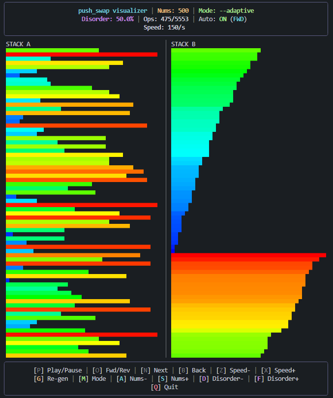

# ft_ps_visu

A terminal visualizer for the **42 push_swap** project. It generates controlled random sequences with specific disorder levels, runs your `push_swap` executable, and renders a real-time TUI (Terminal User Interface) with interactive playback controls.

---

---

## Features

- **Real-time TUI visualization** — watch your `push_swap` algorithm sort stacks live in the terminal.
- **Controlled disorder generation** — creates sequences with precise inversion percentages.
- **Four test modes** — adaptive, simple, medium, and complex.
- **Interactive controls** — play/pause, forward/reverse, step-by-step, speed adjustment, and more.
- **True-color bars** — gradient-colored bars representing values for easy visual tracking.
- **Responsive layout** — adapts to terminal resize events.

---

## Requirements

- Python 3.7+
- A compiled `push_swap` executable that accepts a `--<mode>` flag and the numbers to sort
- A terminal that supports:
  - ANSI escape codes
  - True-color (24-bit RGB) for the best experience
  - Alternate screen buffer (`\033[?1049h` / `\033[?1049l`)

> **Note:** On Windows, use Windows Terminal, WSL, or any modern terminal emulator. The classic `cmd.exe` console may not render Unicode block characters or true-color correctly.

---

## Installation

> **Tip:** If you run into installation errors, try updating `pip` first:
> ```bash
> pip install --upgrade pip
> # or
> pip3 install --upgrade pip
> ```

### Option 1: Install from PyPI (recommended)

Using `pip`:

```bash
pip install ft_ps_visu
```

Using `pip3`:

```bash
pip3 install ft_ps_visu
```

User-local install (no sudo required — `pip`):

```bash
pip install --user ft_ps_visu
```

Using `python3 -m pip`:

```bash
python3 -m pip install ft_ps_visu
```

> **Note:** When using `--user`, the `ft_ps_visu` binary is installed to a user-local `bin/` directory. Make sure this directory is on your `PATH`, or use the `python3 -m` execution methods shown below.

---

### Option 2: Install from source

Clone this repository:

```bash
git clone https://github.com/italoalmeida0/ft_ps_visu.git
cd ft_ps_visu
```

Editable / development mode (`pip`):

```bash
pip install -e .
```

Normal install (`pip`):

```bash
pip install .
```

---

### Option 3: Run with `pipx` (isolated, no install required)

If you have [`pipx`](https://pypa.github.io/pipx/) installed, you can run the visualizer directly without permanently installing it:

```bash
pipx run ft_ps_visu ./push_swap
```

Or install it into an isolated environment:

```bash
pipx install ft_ps_visu
```

Then run normally:

```bash
ft_ps_visu ./push_swap
```

---

Make sure your `push_swap` binary is compiled and executable:

```bash
make
chmod +x push_swap
```

---

## Usage

### Basic usage

```bash
ft_ps_visu ./push_swap
```

With custom number of elements:

```bash
ft_ps_visu ./push_swap 100
```

With custom disorder percentage (0–55):

```bash
ft_ps_visu ./push_swap 500 30
```

If `ft_ps_visu` is **not** found on your `PATH`, run via the module:

```bash
python3 -m ft_ps_visu ./push_swap
```

Or using the `.cli` submodule directly:

```bash
python3 -m ft_ps_visu.cli ./push_swap
```

From the cloned source directory (no install required):

```bash
python3 ft_ps_visu/cli.py ./push_swap
```

---

### Replay from files (`--ops` / `--nums`)

Instead of generating random numbers and running `push_swap`, you can load operations and/or numbers directly from files. This is useful for replaying and debugging specific test cases (for example, reports generated by `ft_ps_tester`).

| Flag | Description |
|------|-------------|
| `--ops <file>`  | Load operations from a file instead of running `push_swap` |
| `--nums <file>` | Load input numbers from a file instead of generating them |

Both flags are optional and can be used independently or together.

Replay only the operations (numbers are still generated randomly):

```bash
ft_ps_visu --ops report_100_simple_ops_1.txt ./push_swap
```

Replay with both numbers and operations from files (push_swap is **not** executed):

```bash
ft_ps_visu --ops report_100_simple_ops_1.txt --nums report_100_simple_nums_1.txt ./push_swap
```

When `--ops` is passed, `--nums` is **required**. The `push_swap` path becomes optional but can still be provided (for example, to enable the `make` feature).

> **Note:** When `--ops` is provided, the visualizer does not run `push_swap`. Controls that would regenerate data or change generation parameters are hidden from the UI.

---

## Controls

| Key | Action |
|-----|--------|
| `P` | Play / Pause |
| `O` | Toggle Forward / Reverse direction |
| `N` | Next step (forward one operation) |
| `B` | Back step (reverse one operation) |
| `X` | Increase speed |
| `Z` | Decrease speed |
| `G` | Re-generate data with current settings |
| `M` | Cycle through modes (adaptive → simple → medium → complex) |
| `A` | Decrease number of elements |
| `S` | Increase number of elements |
| `D` | Decrease disorder percentage |
| `F` | Increase disorder percentage |
| `C` | Run `make` in the push_swap directory |
| `E` | Check if Stack A is sorted (shows OK/KO) |
| `Q` | Quit |

> **Note:** Controls `G`, `A`, `S`, `D`, `F` are hidden when `--ops` is used. Controls `G`, `A`, `S`, `D`, `F`, `C` are hidden when `--nums` is used without `--ops`. `C` is hidden when `--ops` is used or when no push_swap path is provided.

### Make screen (`C`)

Pressing `C` opens a make screen that runs `make` in the directory of the provided `push_swap` executable.

| Key | Action |
|-----|--------|
| `W` | Return to the visualizer (only if the binary exists) |
| `C` | Run `make` again |
| `R` | Run `make re` |
| `Q` | Quit |

---

## Modes / Flags

Your `push_swap` must support the following flags (passed as `--<mode>` before the numbers):

| Mode       | Disorder range | Description                              |
|------------|----------------|------------------------------------------|
| `simple`   | 15.0% – 19.9%  | Nearly sorted sequences                  |
| `medium`   | 20.0% – 49.9%  | Moderately shuffled sequences            |
| `complex`  | 50.0% – 55.0%  | Heavily shuffled sequences               |
| `adaptive` | 15.0% – 55.0%  | Random disorder across the full spectrum |

> **Note:** If your `push_swap` does **not** implement these flags, the visualizer will still work if your program ignores unknown flags and simply sorts the provided numbers.

---

## How it works

1. **Generate** a random sequence with the desired size and disorder level.
2. **Run** your `push_swap` executable with the sequence.
3. **Capture** the operations printed to `stdout`.
4. **Render** a TUI showing both stacks as colored bars.
5. **Animate** the operations at the chosen speed, allowing forward and reverse playback.

---

## License

This project is licensed under the [MIT License](LICENSE).
